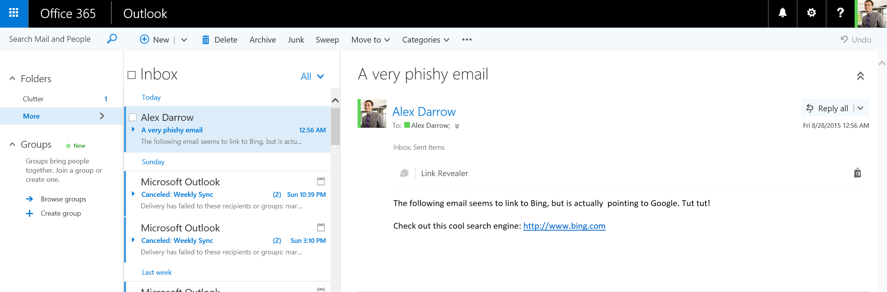

# Outlook add-in: Mail add-in for a read scenario which finds and parses all links in the body of an email. 

**Table of contents**

* [Summary](#summary)
* [Prerequisites](#prerequisites)
* [Key components of the sample](#components)
* [Description of the code](#codedescription)
* [Build and debug](#build)
* [Troubleshooting](#troubleshooting)
* [Questions and comments](#questions)
* [Contributing](#contribute)
* [Additional resources](#additional-resources)

<a name="summary"></a>
##Summary

In this sample we show you how to use the [JavaScript API for Office](https://msdn.microsoft.com/library/b27e70c3-d87d-4d27-85e0-103996273298(v=office.15)) to create an Outlook add-in that parses the body of an email looking for hyperlinks. The following is a  picture of the scenario in question (in the Outlook Web App).

 
 
This add-in is configured to use [add-in commands](https://msdn.microsoft.com/EN-US/library/office/mt267547.aspx), so when you're reading your email in the desktop client, you launch the add-in by choosing this command button in the ribbon:


 It has happened to us all during our email lifetimes - we receive what looks like a regular email from what seems like a  trusted source that contains hyperlinks. We click on one of those links without thinking and are then at risk of having our machine, our systems or business compromised. This is a classic phishing scenario wherein the hyperlinks in an email are not what they seem. This sample shows an alternative way of verifying hyperlinks. Instead of hovering over a link to see what the real target URL behind the link text is, and perhaps risking an accidental click on said link, this add-in finds all links in an email and displays them in a decomposed format of link text and link URL. In this way, the user can see clearly what address is behind the link text. The sample goes a little further. If a link has a URL as the link text and that URL doesn't match the underlying href of the link, the link is flagged in red in the add-in to make sure the user sees this potentially phishy link. 

<a name="prerequisites"></a>
##Prerequisites
This sample requires the following:  

  - Visual Studio 2013 with Update 5 or Visual Studio 2015.  
  - A computer running Exchange 2013 with at least one email account, or an Office 365 account. [Join the Office 365 Developer Program and get a free 1 year subscription to Office 365](https://aka.ms/devprogramsignup).
  - Internet Explorer 9 or later, which must be installed but doesn't have to be the default browser. To support Office Add-ins, the Office client that acts as host uses browser components that are part of Internet Explorer 9 or later.
  - One of the following as the default browser: Internet Explorer 9, Safari 5.0.6, Firefox 5, Chrome 13, or a later version of one of these browsers.
  - Familiarity with JavaScript programming and web services.

<a name="components"></a>
##Key components

This solution was created in [Visual Studio](https://msdn.microsoft.com/library/office/fp179827.aspx#Tools_CreatingWithVS). It consists of two projects - LinkRevealer and LinkRevealerWeb. Here's a list of the key files within those projects. 
#### LinkRevealer project

* [```LinkRevealer.xml```](https://github.com/OfficeDev/Outlook-Add-in-LinkRevealer/blob/master/LinkRevealer/LinkRevealerManifest/LinkRevealer.xml) The [manifest file](https://msdn.microsoft.com/library/office/jj220082.aspx#StartBuildingApps_AnatomyofApp) for the Word add-in.

#### LinkRevealerWeb project

* [```Home.html```](https://github.com/OfficeDev/Outlook-Add-in-LinkRevealer/blob/master/LinkRevealerWeb/AppRead/Home/Home.html) The HTML user interface for the Word add-in.
* [```Home.js```](https://github.com/OfficeDev/Outlook-Add-in-LinkRevealer/blob/master/LinkRevealerWeb/AppRead/Home/Home.js) The JavaScript code used by Home.html to interact with Word using the JavaScript for Office API. 


<a name="codedescription"></a>
##Description of the code

The core logic of this sample is in the [```Home.js```](https://github.com/OfficeDev/Outlook-Add-in-LinkRevealer/blob/master/LinkRevealerWeb/AppRead/Home/Home.js) file in the LinkRevealerWeb project. Once the add-in is initialized, the [```getAsync()```](https://msdn.microsoft.com/library/office/mt269089.aspx) method of the Body object is used to retrieve the body of the email in HTML format. When this asynchronous operation is completed, our callback function, processHtmlBody, is invoked. This function first loads the retrived body content into a DomParser. This object tree is then parsed using the getElementsByTagName("a") method to find all hyperlinks. Finally, each hyperlink is displayed on the UI and analyzed to see if any links are phishy. 

Using body.getAsync() to retrieve the body of an email has numerous advantages over earlier solutions. In previous versions of Office.js, the only way to get the body of an email in a read scenario was to call [```makeEWSRequest```](https://msdn.microsoft.com/library/office/fp161019.aspx) on the mailbox object. Not only was the contruction of this SOAP request more involved, but it also required an add-in to have ReadWriteMailbox permissions. The getAsync() solution only requires that the add-in has ReadItem permissions.  

<a name="build"></a>
##Build and debug
1. Open the [```LinkRevealer.sln```](LinkRevealer.sln) file in Visual Studio.
2. Press F5 to build and deploy the sample add-in 
3. When Outlook launches, select an email from your inbox
4. Launch the add-in by selecting it from the add-in app bar




5. When the add-in launches, it will scan the selected email message body for hyperlinks. Any links found will be displayed in a table in the main pane of the add-in. If the add-in thinks a link is suspicious, it will mark that row in the table in red. A suspicious link is defined as one that has a URL in the link text that does not match the URL in the actual href of the link. 


<a name="troubleshooting"></a>
## Troubleshooting

- If the add-in does not appear in the task pane, Choose **Insert > My Add-ins >  Link Revealer**.

<a name="questions"></a>
## Questions and comments

- If you have any trouble running this sample, please [log an issue](https://github.com/OfficeDev/Outlook-Add-in-LinkRevealer/issues).
- Questions about Office Add-ins development in general should be posted to [Stack Overflow](http://stackoverflow.com/questions/tagged/office-addins). Make sure that your questions or comments are tagged with [office-addins].

<a name="contribute"></a>
## Contributing ##
We encourage you to contribute to our samples. For guidelines on how to proceed, see our [contribution guide](./Contributing.md)

This project has adopted the [Microsoft Open Source Code of Conduct](https://opensource.microsoft.com/codeofconduct/). For more information see the [Code of Conduct FAQ](https://opensource.microsoft.com/codeofconduct/faq/) or contact [opencode@microsoft.com](mailto:opencode@microsoft.com) with any additional questions or comments.


<a name="additional-resources"></a>
## Additional resources ##

- [More Add-in samples](https://github.com/OfficeDev?utf8=%E2%9C%93&query=-Add-in)
- [Office Add-ins](http://msdn.microsoft.com/library/office/jj220060.aspx)
- [Anatomy of an Add-in](https://msdn.microsoft.com/library/office/jj220082.aspx#StartBuildingApps_AnatomyofApp)
- [Creating an Office add-in with Visual Studio](https://msdn.microsoft.com/library/office/fp179827.aspx#Tools_CreatingWithVS)


## Copyright
Copyright (c) 2015 Microsoft. All rights reserved.

